# ICT Business Analyst - Showcase Me!

June - July 2023

> 🔨 Ceci est le labo final réalisé chez Technifutur. Il s'agissait de créer un concept d'application et d'en réaliser l'analyse fonctionnelle.
>
> _Envie de partager avec le monde entier des projets que vous avez réalisés ? Dans votre parcours professionnel ou dans le cadre de vos loisirs ? L’application « Showcase me ! » vous permet de réaliser un portfolio à votre image en quelques clics ! Ca ne coûte rien d’essayer, c’est gratuit..._
>

Dans ce repo, vous trouverez les différentes étapes préparatoires et analytiques du projet.
---

**ICT BUSINESS ANALYST**

Les ICT Business Analysts travaillent avec les utilisateurs pour formuler les exigences du système, développer les plans et la documentation du système, examiner et évaluer les systèmes existants, et concevoir et modifier les systèmes pour répondre aux besoins commerciaux des utilisateurs.

Les analystes d'affaires TIC utilisent des techniques de modélisation des données (UML, BPMN...) et des processus pour créer des spécifications de système claires pour la conception et le développement de logiciels de système. Ils constituent une référence centrale et une source d'information, fournissant des conseils et une assistance dans le processus de prise de décision du projet de système.

## 01. Charte de projet (Charter Project)

_Une charte de projet est un document formel, généralement court, qui décrit le projet dans son intégralité, y compris les objectifs, la manière dont il sera réalisé et les parties prenantes._

Cette charte comprend :

- Présentation et motivation du projet
- Objectifs et indicateurs clés de performance
- Périmètre / Hors Périmètre
- Hypothèses
- Contraintes
- Livrables et Réception
- Critères de succès
- Estimation des Ressources Financières
- Echéancier
- Risques Majeurs (SWOT)
- Gestionnaire de projet
- Intervenants et Parties prenantes
- Instances de gouvernance du projet

_Téléchargement :_ [Charter Project - PDF](01-charter-project_fr.pdf)

## 02. Cahier des charges (Specifications)

_Le cahier des charges (souvent abrégé CDC) est un document ou dossier indispensable dans le cadre du développement d'un projet. Il représente un outil de pilotage primordial pour définir les besoins et les spécifications (éléments et règles) liés à un projet._

Le cahier des charges reprend le Charter Project mais en incluant l'analyse fonctionnelle (diagrammes UML, BPMN)

Ce cahier des charges comprend :

- Cahier des charges
    - A qui l'application est-elle destinée ?
    - Qui est à l'origine de la demande ?
    - Quand est-elle attendue ?
    - Pourquoi est-elle attendue ? / Qu'est-ce qui a motivé la demande ?
    - Quels problèmes doit-elle résoudre ?
    - Quelles sont les fonctions (besoins fonctionnels)
    - Que veut-on obtenir ? / Quels sont les bénéfices attendus
    - Quelle sera la portée du système : l'entreprise, un seul service ?
    - Quelles seront les conditions d'utilisation ?
    - Comment saura-t-on que l’objectif a été atteint ?
- Project charter
- BPMN ASIS
    - Partage de portfolio au format papier
    - Partage de portfolio au format web
- Diagramme de packages de Cas d’utilisation
- Diagramme de cas d’utilisation par package
    - Concerne : Utilisateur avec un plan ‘basic’.
    - Concerne : Utilisateur avec un plan ‘premium’.
    - Concerne : Utilisateur avec un plan ‘business’.
    - Concerne : Utilisateur avec un statut ‘admin’.
    - Concerne : SI ShowcaseMe + API externes
- Scénarii nominaux et alternatifs
    - Description générale
    - Scénarios
        - 1) Happy scénario : l’utilisateur s’inscrit et ajoute jusqu’à 6 projets
        - 2) Cas alternatif : l’utilisateur veut ajouter plus de 6 projets
        - 3) Cas d’exception : L’utilisateur ne renouvelle pas son abonnement
- Diagrammes d’activités
- BPMN TOBE
    - Process général
    - Process d’authentification
    - Process fonctionnalités produits
    - Sub-process édition du profil
    - Sub-process visualisation des produits
    - Sub-process édition des produits
    - Sub-process payement
- Diagramme de classes
- Wireframes
    - Login / landing page
    - Homepage
    - Product page (Premium user)
    - Product page (Portfolio) – Édition
    - Product page (Project) – Édition
    - CTA lorsqu’un utilisateur ‘basic’ veut ajouter plus de 6 projets
    - Plan tarifaire
- Maquettes
- Schéma Entité-Association version finale
- Schéma Relationnel
- Glossaire

_Téléchargement :_ [Cahier des charges - PDF](02-specifications_fr.pdf)

NB : dossier _annexes_ nécessaire pour pouvoir avoir les images en grand.

## 03. BPMN ASIS

_Le Business Process Model and Notation (BPMN) ou norme de modélisation des processus métier en français, est une méthode de logigramme qui modélise de A à Z les étapes d'un processus métier planifié. L'élaboration et l'alimentation des diagrammes BPMN "As-Is" et "To-Be" sont des techniques efficaces pour transformer une vision en résultats._

Le diagramme "As-Is" offre une vue d'ensemble détaillée de l'état actuel des processus, de la culture et des capacités de l'organisation._

**Partage d'un portfolio en version papier**

_Téléchargement :_ [Diagramme BPMN : Partage d'un portfolio en version papier - Image](03a-bpmn-asis-paper-portfolio.png)

**Partage d'un portfolio en version web**

_Téléchargement :_ [Diagramme BPMN : Partage d'un portfolio en version web - Image](03b-bpmn-asis-web-portfolio.png)

## 04. BPMN TOBE

_Le diagramme To-Be, fournit une vue d'ensemble de l'état futur, décrivant comment les processus, la culture et les capacités de l'organisation apparaîtront à l'avenir._

**Process général**

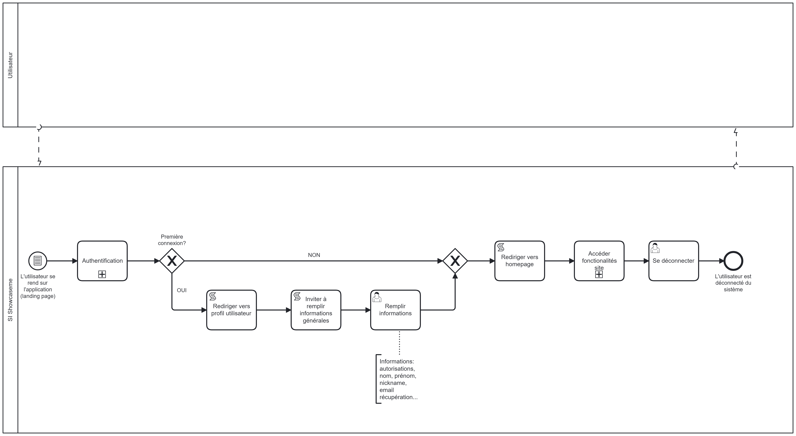

_Téléchargement :_ [Diagramme BPMN : Process général - Image](04a-bpmn-tobe-fullprocess.png)

**Process d’authentification**

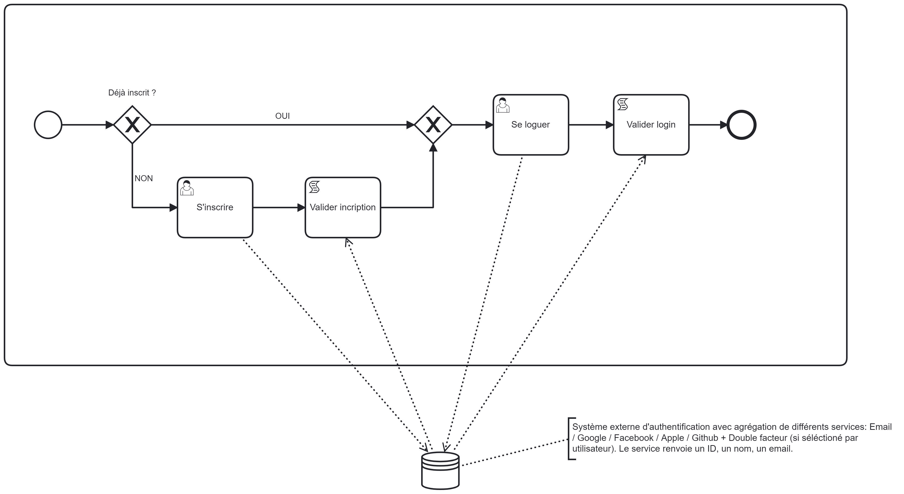

_Téléchargement :_ [Diagramme BPMN : Process d’authentification - Image](04b-bpmn-tobe-auth.png)

**Process fonctionnalités produits**

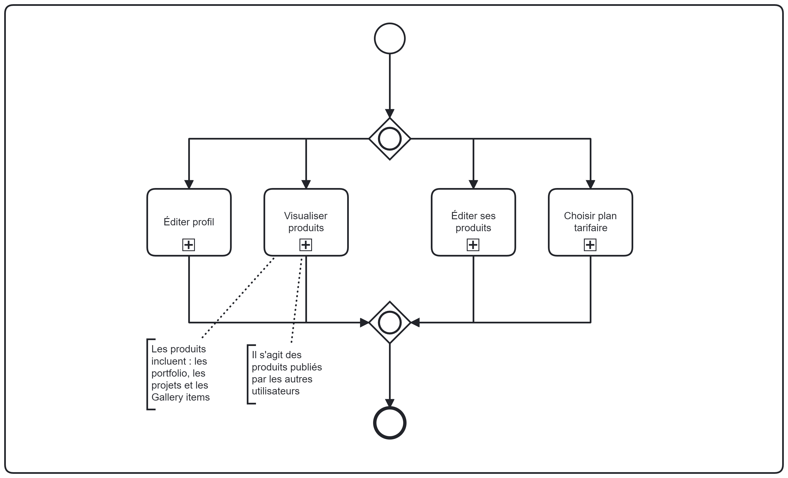

_Téléchargement :_ [Diagramme BPMN : Process fonctionnalités produits - Image](04c-bpmn-tobe-functionalities.png)

**Sub-process édition du profil**

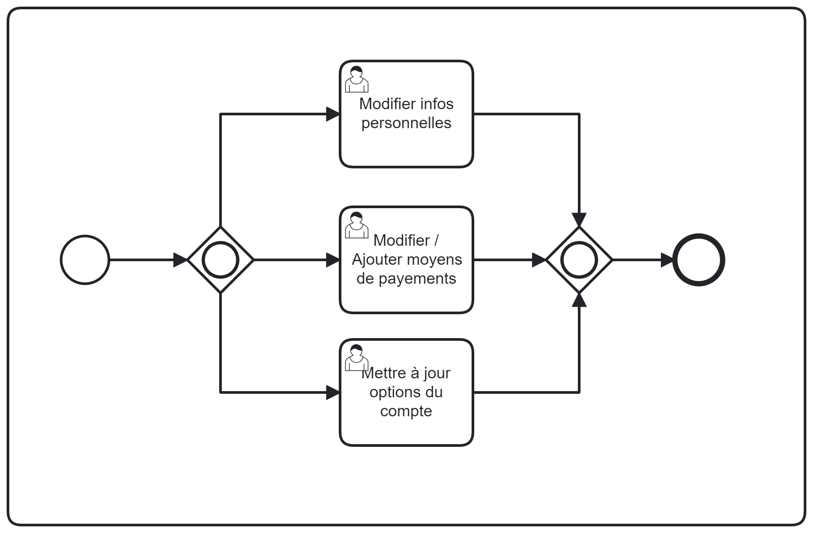

_Téléchargement :_ [Diagramme BPMN : Sub-process édition du profil - Image](04d-bpmn-tobe-edit-profile.png)

**Sub-process visualisation des produits**

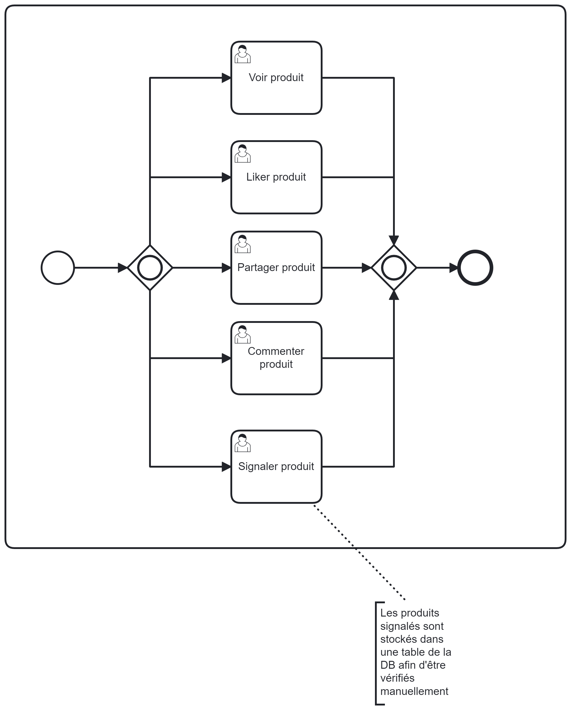

_Téléchargement :_ [Diagramme BPMN : Sub-process visualisation des produits - Image](04e-bpmn-tobe-show-products.png)

**Sub-process édition des produits**

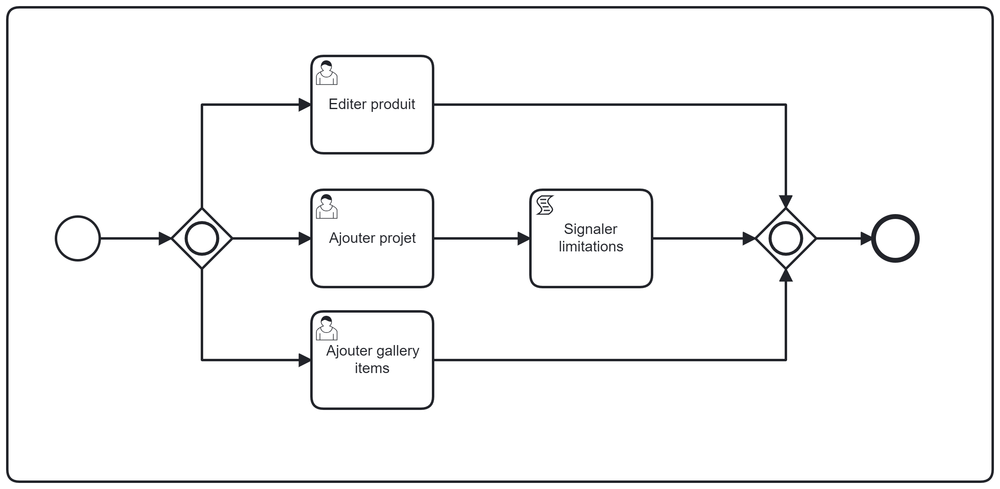

_Téléchargement :_ [Diagramme BPMN : Sub-process édition des produits - Image](04f-bpmn-tobe-edit-products.png)

**Sub-process payement**

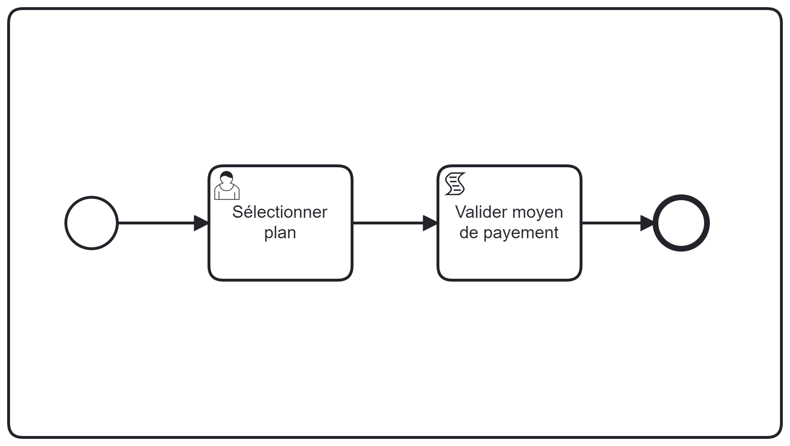

_Téléchargement :_ [Diagramme BPMN : Sub-process payement - Image](04g-bpmn-tobe-pay-plan.png)

## 05. Diagramme entités-associations (Entity Relationship Diagram)

_Un diagramme entité-association est un type d'organigramme illustrant la façon dont des « entités » telles que des personnes, objets ou concepts sont liées les unes aux autres au sein d'un système (cardinalités, héritages...)._

**Schéma Entité-Association**

Celui-ci est découpé en modules comme suit :

- User
- Account management
- Product management
- Interactions with other users
- System process

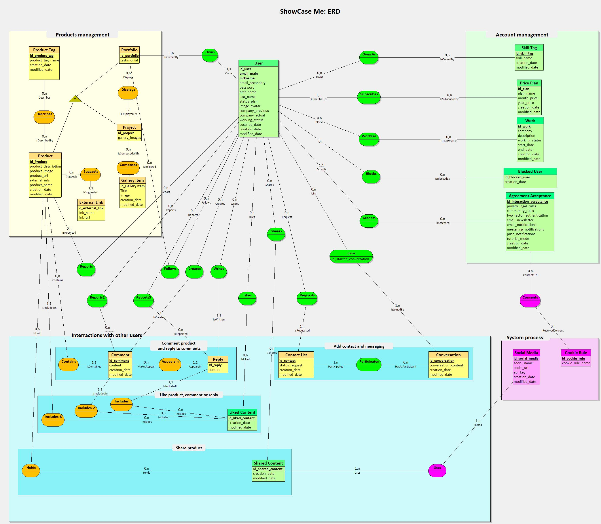

_Téléchargement :_ [Diagramme Entité-Association - Image](05-entity-relationship-diagram.jpg)

## 06. Shéma relationnel de base de données (Database relational Schema)

_Le schéma relationnel correspond à l'ensemble des relations présentes dans une base de données._

**Schéma Relationnel**

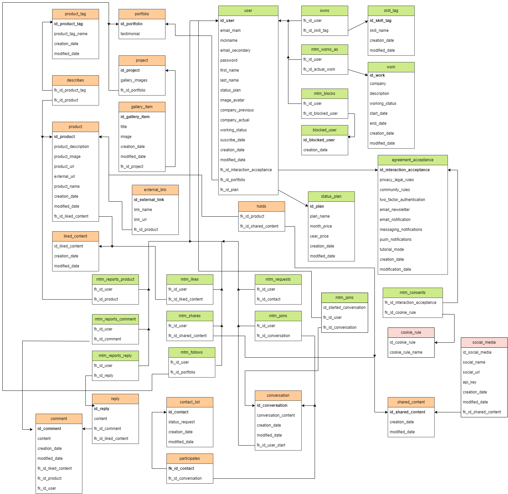

_Téléchargement :_ [Schéma Relationnel - Image](06-database-relational-schema.png)

## 07. UML : diagramme d'activités (UML Activity Diagram)

_Le langage UML (Unified Modeling Language, ou langage de modélisation unifié) a été pensé pour être un langage de modélisation visuelle commun, et riche sémantiquement et syntaxiquement.

Un diagramme d'activité fournit une vue du comportement d'un système en décrivant la séquence d'actions d'un processus.
_

**Diagramme d'activités**

Il décrit le processus de fonctionnement de l'application en fonction des choix de l'utilisateur.

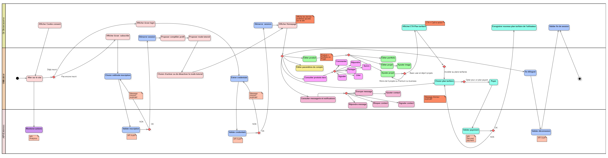

_Téléchargement :_ [UML : Diagramme d'activités - Image](07-uml-activity-diagram.png)

## 08. UML : diagramme de classes (UML Class Diagram)

_Les diagrammes de classes sont l'un des types de diagrammes UML les plus utiles, car ils décrivent clairement la structure d’un système particulier en modélisant ses classes, ses attributs, ses opérations et les relations (associations) entre ses objets._

**Diagramme de classes**

Ici il reprend les sections supérieure et intermédiaires. A ce stade de l’analyse, les
méthodes (sections inférieures) ne sont pas encore définies.

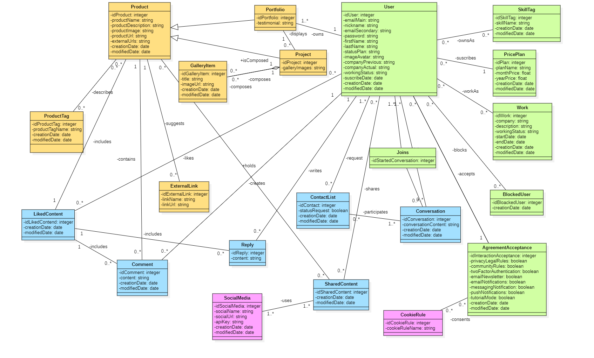

_Téléchargement :_ [UML : Diagramme de classes - Image](08-uml-class-diagram.png)

## 09. UML : diagramme d'étude de cas d'utilisation (UML Use Cases Diagrams)

_Les diagrammes de cas d'utilisation sont des diagrammes UML utilisés pour une représentation du comportement fonctionnel d'un système logiciel. Ils sont utiles pour des présentations auprès de la direction ou des acteurs d'un projet, mais pour le développement, les cas d'utilisation sont plus appropriés._

**Diagramme de packages de Cas d’utilisation**

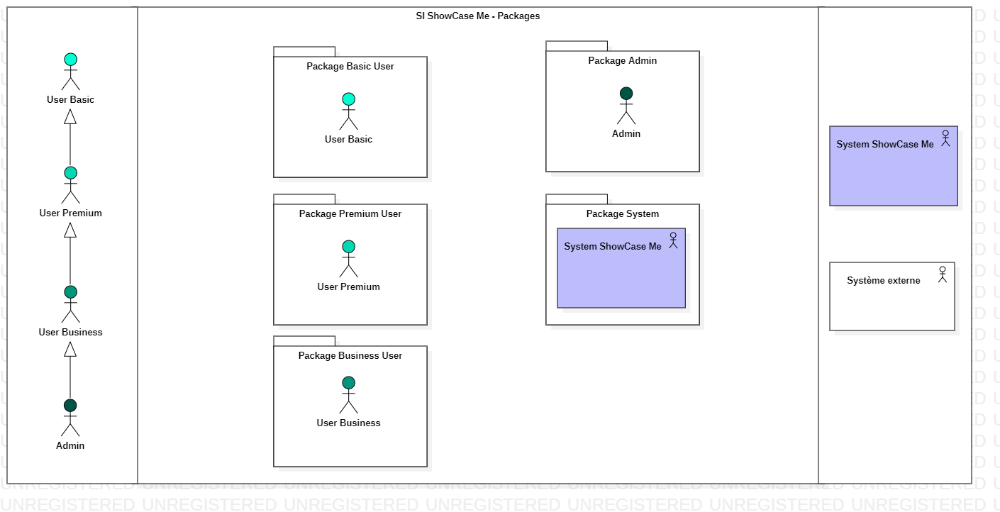

_Téléchargement :_ [UML Use case : Diagramme de packages de Cas d’utilisation - Image](09a-uml-use-cases-diagram-packages.png)

**Diagramme de cas d’utilisation par package : Utilisateur avec un plan ‘basic’**

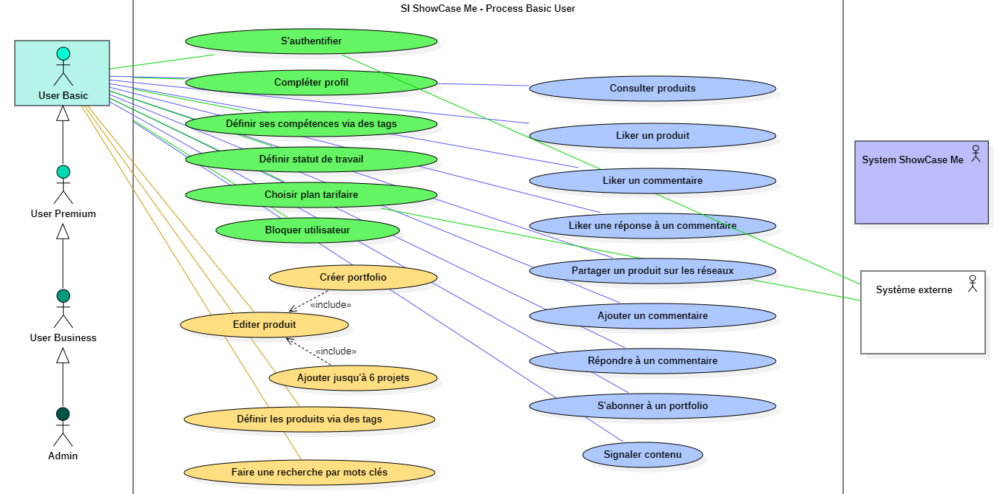

_Téléchargement :_ [UML Use case : Utilisateur avec un plan ‘basic’ - Image](09b-uml-use-cases-diagram-process-basic-user.png)

**Diagramme de cas d’utilisation par package : Utilisateur avec un plan ‘premium’**

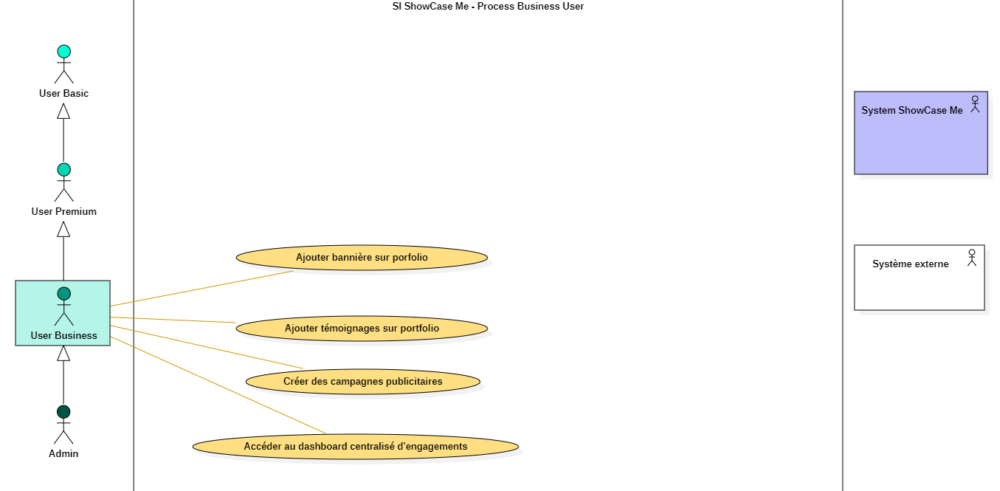

_Téléchargement :_ [UML Use case : Utilisateur avec un plan ‘premium’ - Image](09c-uml-use-cases-diagram-business-user.png)

**Diagramme de cas d’utilisation par package : Utilisateur avec un plan ‘business’**

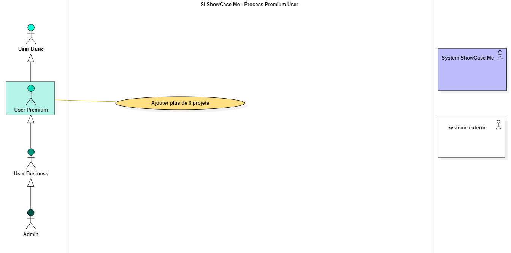

_Téléchargement :_ [UML Use case : Utilisateur avec un plan ‘business’ - Image](09d-uml-use-cases-diagram-premium-user.png)

**Diagramme de cas d’utilisation par package : Utilisateur avec un statut ‘admin’**

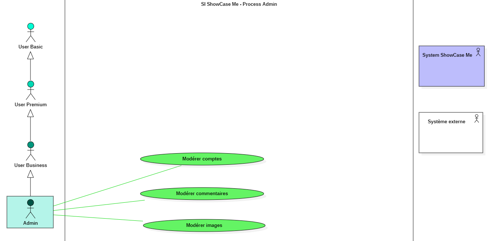

_Téléchargement :_ [UML Use case : Utilisateur avec un statut ‘admin’ - Image](09e-uml-use-cases-diagram-admin.png)

**Diagramme de cas d’utilisation par package : SI ShowcaseMe + API externes**

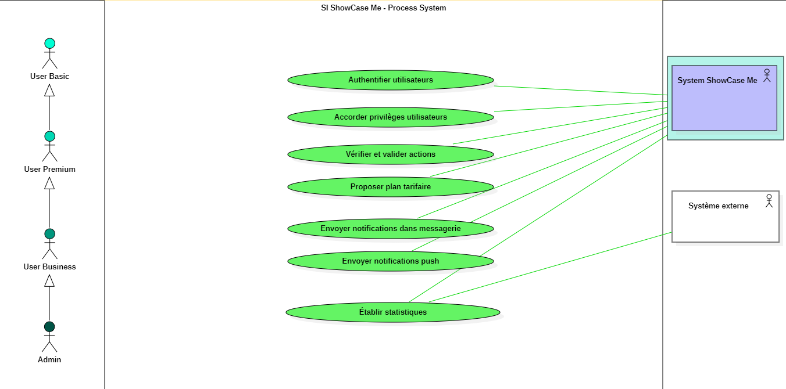

_Téléchargement :_ [UML Use case : SI ShowcaseMe + API externes - Image](09f-uml-use-cases-diagram-system.png)

## 10. UML : scenarii d'études de cas d'utilisation (UML Use Cases Scenarii)

_Les documents de scénarios d'utilisation décomposent un processus en décrivant les acteurs, le flux de travail typique mais aussi les choses qui pourraient mal se passer._

Les scenarri concernent :

- 1) Happy scénario : l’utilisateur s’inscrit et ajoute jusqu’à 6 projets
- 2) Cas alternatif : l’utilisateur veut ajouter plus de 6 projets
- 3) Cas d’exception : L’utilisateur ne renouvelle pas son abonnement

_Téléchargement :_ [Scénarii nominaux et alternatifs - PDF](10-uml-use-cases-scenarii_fr.pdf)

## 11. Wireframes

_Le Wireframe est la maquette « fil-de-fer » de l'interface. C'est un schéma de la structure et des fonctionnalités de l'application mobile ou du site. Ces maquettes, dessinées sur du papier ou digitales, présentent un degré d'interactivité variable._

**Login / landing page**

_Téléchargement :_ [Wireframes : Login - Image](11a-wireframes-login.png)

**Homepage**

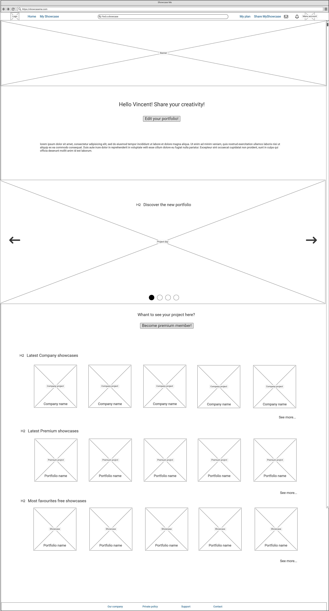

_Téléchargement :_ [Wireframes : Homepage - Image](11b-wireframes-homepage.png)

**Product page (Premium user)**

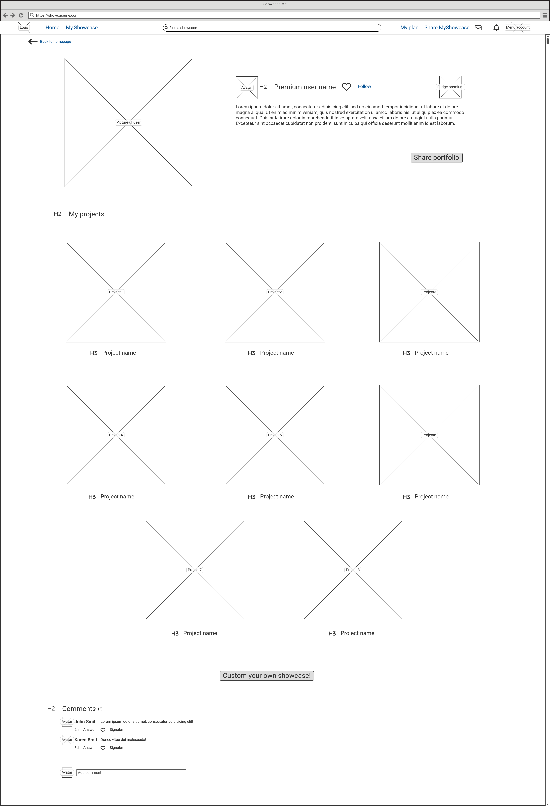

_Téléchargement :_ [Wireframes : Product page (Premium user) - Image](11c-wireframes-portfolio-premium-visitor.png)

**Product page (Business user)**

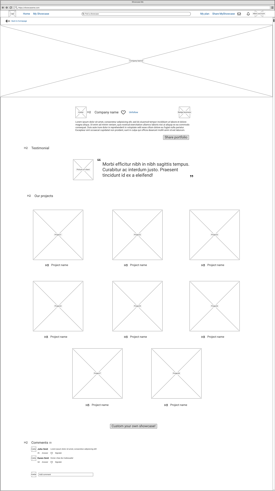

_Téléchargement :_ [Wireframes : Product page (Business user) - Image](11d-wireframesd-portfolio-business-visitor.png)

**Product page (Portfolio) – Édition**

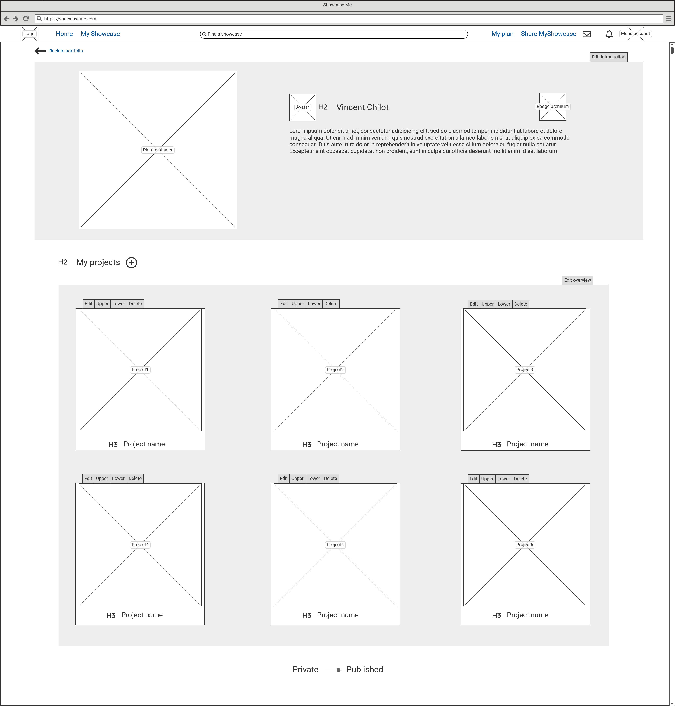

_Téléchargement :_ [Wireframes : Product page (Portfolio) – Édition - Image](11e-wireframes-portfolio-basic-edit.png)

**Product page (Project) – Édition**

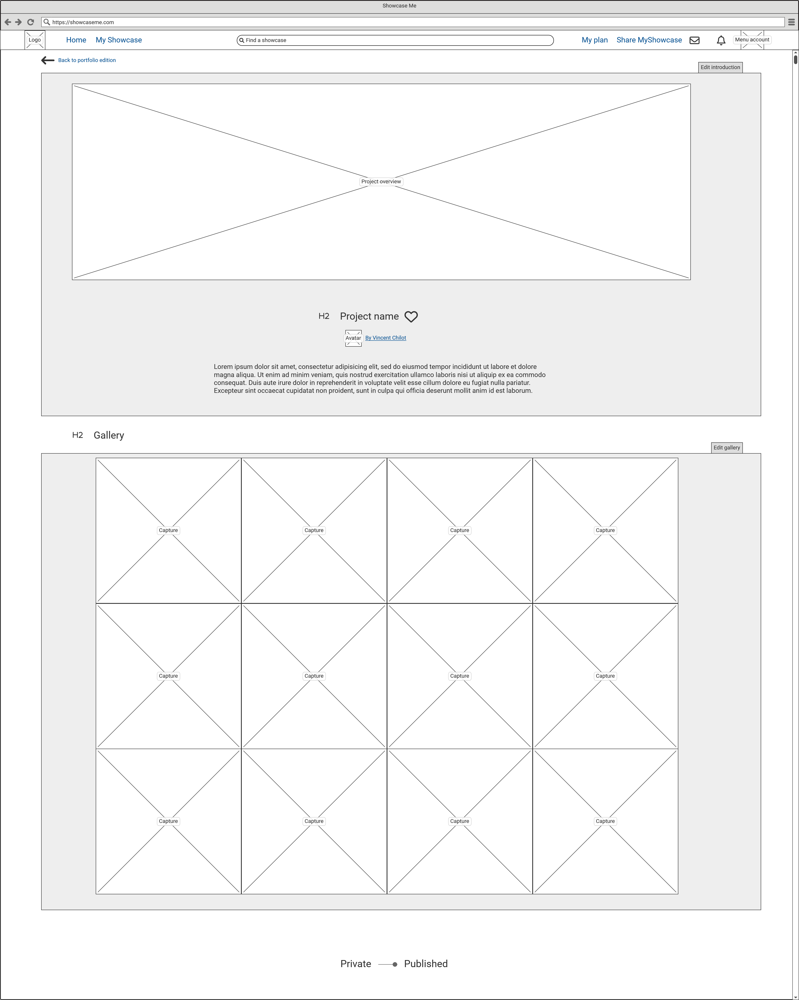

_Téléchargement :_ [Wireframes : Product page (Project) – Édition - Image](11f-wireframes-portfolio-project-edit.png)

**CTA lorsqu’un utilisateur ‘basic’ veut ajouter plus de 6 projets**

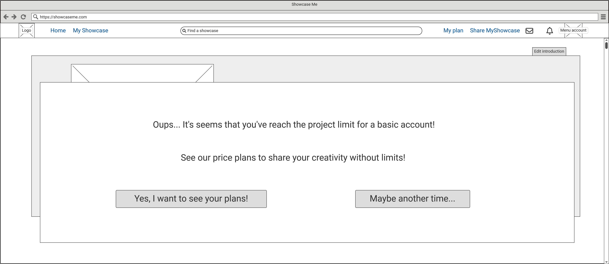

_Téléchargement :_ [Wireframes : CTA - Image](11g-wireframes-portfolio-basic-edit-limit.png)

**Plan tarifaire**

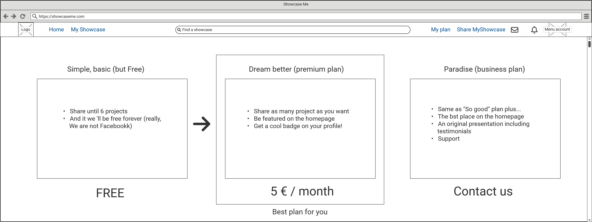

_Téléchargement :_ [Wireframes : Plan tarifaire - Image](11h-wireframes-prices-plans-from-free.png)

## 12. Maquette (Mockup)

Il n'est pas du ressort du BA de créer des maquettes, mais bien du graphiste.
Les maquettes graphiques peuvent distraire le client du côté fonctionnel de l'application.

Elles peuvent néanmoins apporter un plus dans les présentations, dans certains cas.

**Mockup Homepage**

_Téléchargement :_ [Mockup : homepage - Image](12-mockup-homepage.png)

-----------------------------------------------